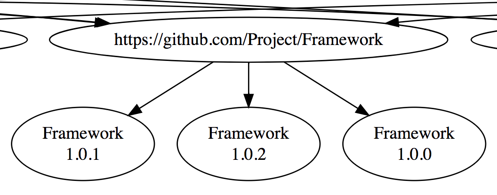

# carthage_dep



## Use Case

You are developing an iOS application, which uses several frameworks. Both application and frameworks handle their dependencies using [Carthage](https://github.com/Carthage/Carthage).

When a framework is developed stand-alone, it uses its own dependencies defined in Cartfile and Cartfile.private. When that framework is embedded into an application, the application has to embed all framework dependencies.

## Problem

There is a possibility that application already uses same dependencies as framework and that those are different versions. When application, or a dependency, uses several other frameworks, the possibility of version conflicts multiplies.

When you're developing a feature in application and/or framework locally, using Cartfile references to a branch at git server or to a local folder, you can check, if there are any other frameworks that need to refer to the new code, too.

These can cause compile problems or runtime crashes.

## Solution

To make these dependencies more visual, python script `carthage_dep` finds and parses EITHER `Cartfile` and `Cartfile.private` OR `Cartfile.resolved` contents from a folder and its subfolders and generates a [GraphViz](https://graphviz.gitlab.io/download/) compatible DOT graph file.

This should make it easier to discover version number conflicts between dependencies. This also gives a rough idea of overall application dependency graph.

## How to use

```
project_root/
├── application/
├── framework_a/
└── framework_b/
```

Run `carthage_dep.py` at project root folder to scan all project related folders at the same time. It will print `GraphViz` compatible text to output, which you can direct to a text file (and edit afterwards, if needed).

> carthage_dep.py > graph.dot
> open graph.dot -a graphviz

*--use_resolved*

Check only Cartfile.resolved files. Otherwise checking Cartfile and Cartfile.private files by default.

*--ignore-version*

List only dependency names, ignoring whether there are version mismatches between different module references.

## License

carthage_dep is released under the MIT License.
